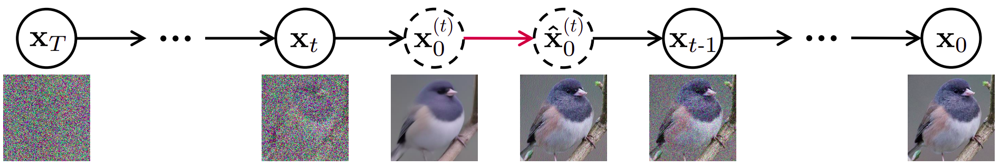
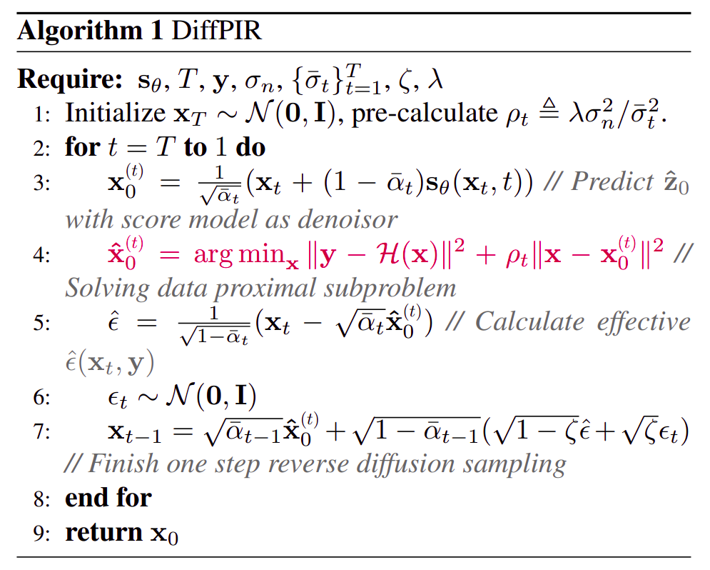

# Denoising Diffusion Models for Plug-and-Play Image Restoration

[Yuanzhi Zhu](https://yuanzhi-zhu.github.io/about/), [Kai Zhang](https://cszn.github.io/), [Jingyun Liang](https://jingyunliang.github.io/), [Jiezhang Cao](https://www.jiezhangcao.com/), [Bihan Wen](https://personal.ntu.edu.sg/bihan.wen/), [Radu Timofte](http://people.ee.ethz.ch/~timofter/), [Luc Van Gool](https://vision.ee.ethz.ch/people-details.OTAyMzM=.TGlzdC8zMjQ4LC0xOTcxNDY1MTc4.html).

[[project page](https://yuanzhi-zhu.github.io/DiffPIR/)] [[paper](https://arxiv.org/pdf/2305.08995.pdf)]

This repository contains the code and data associated with the paper "Denoising Diffusion Models for Plug-and-Play Image Restoration", which was presented at the CVPR workshop NTIRE 2023.

This code is based on the [OpenAI Guided Diffusion](https://github.com/openai/guided-diffusion) and [DPIR](https://github.com/cszn/DPIR).

___________
**Contents**
- [Denoising Diffusion Models for Plug-and-Play Image Restoration](#denoising-diffusion-models-for-plug-and-play-image-restoration)
  - [Abstract](#abstract)
  - [Setting Up](#setting-up)
    - [Clone and Install](#clone-and-install)
    - [Model Download](#model-download)
    - [Inference Code](#inference-code)
  - [Brief Introduction](#brief-introduction)
  - [Results](#results)
    - [Quantitative Results](#quantitative-results)
    - [Qualitative Results](#qualitative-results)
  - [Citation](#citation)
  - [Acknowledgments](#acknowledgments)

## Abstract

Plug-and-play Image Restoration (IR) has been widely recognized as a flexible and interpretable method for solving various inverse problems by utilizing any off-the-shelf denoiser as the implicit image prior. However, most existing methods focus on discriminative Gaussian denoisers. Although diffusion models have shown impressive performance for high-quality image synthesis, their potential to serve as a generative denoiser prior to the plug-and-play IR methods remains to be further explored.
While several other attempts have been made to adopt diffusion models for image restoration, they either fail to achieve satisfactory results or typically require an unacceptable number of Neural Function Evaluations (NFEs) during inference.
This paper proposes DiffPIR, which integrates the traditional plug-and-play method into the diffusion sampling framework. Compared to plug-and-play IR methods that rely on discriminative Gaussian denoisers, DiffPIR is expected to inherit the generative ability of diffusion models. Experimental results on three representative IR tasks, including super-resolution, image deblurring, and inpainting, demonstrate that DiffPIR achieves state-of-the-art performance on both the FFHQ and ImageNet datasets in terms of reconstruction faithfulness and perceptual quality with no more than 100 NFEs.


## Setting Up
### Clone and Install
```bash
git clone https://github.com/yuanzhi-zhu/DiffPIR.git
cd DiffPIR
pip install -r requirements.txt
```
for motion blur, please download https://github.com/LeviBorodenko/motionblur to the DiffPIR folder.

### Model Download
links to model checkpoints can be found in [./model_zoo/README.md](https://github.com/yuanzhi-zhu/DiffPIR/blob/main/model_zoo/README.md)

you can also download with:
```bash
bash download.sh
```
Do not forget to rename "ffhq_10m" to "diffusion_ffhq_m" for code consistency.

### Inference Code
```python
python main_ddpir_sisr.py # SR
python main_ddpir_deblur.py # deblur
python main_ddpir_inpainting.py # inpainting
```
Alternatively:
```python
python main_ddpir.py --opt configs/sisr.yaml # SR
python main_ddpir.py --opt configs/deblur.yaml # deblur
python main_ddpir.py --opt configs/inpaint.yaml # inpainting
```

### Train Your Own Diffusion Models
To train a new diffusion model, please follow [OpenAI Guided Diffusion](https://github.com/openai/guided-diffusion).

## Brief Introduction
Upon comparison with several earlier iterative image restoration methods, such as [USRNet](https://github.com/cszn/USRNet), we found that the diffusion sampling framework offers a more systematic approach to solve data sub-problems and prior sub-problems in an iterative plug and play manner.

Start with the following optimization problem:

$$
\hat{\mathbf{x}} = \mathop{\arg\min}_\mathbf{x}  \frac{1}{2\sigma_n^2}\|\mathbf{y} - \mathcal{H}(\mathbf{x})\|^2 + \lambda \mathcal{P}(\mathbf{x})
$$

In previous works, we can solve this iteratively with:

```math
\begin{align}
\mathbf{{z}}_{k} &= \mathop{\arg\min}_{\mathbf{z}} \frac{1}{2(\sqrt{\lambda/\mu})^2}\|\mathbf{z}-\mathbf{x}_{k}\|^2  + \mathcal{P}(\mathbf{z}) \\
\mathbf{{x}}_{k-1} &= \mathop{\arg\min}_{\mathbf{x}}  \|\mathbf{y} - \mathcal{H}(\mathbf{x})\|^2 + \mu\sigma_n^2\|\mathbf{x}-\mathbf{{z}}_{k} \|^2 
\end{align}
```

In our study, we address the optimization problem stated above with an altered schedule instead:

```math
\begin{align}
\mathbf{{x}}_{0}^{(t)}&=\mathop{\arg\min}_{\mathbf{z}} {\frac{1}{2\bar{\sigma}_t^2}\|\mathbf{z}-\mathbf{x}_{t}\|^2}  + {\mathcal{P}(\mathbf{z})}\\
\mathbf{\hat{x}}_{0}^{(t)}&=\mathop{\arg\min}_{\mathbf{x}}  \|\mathbf{y} - \mathcal{H}(\mathbf{x})\|^2 + \rho_t\|\mathbf{x}-\mathbf{{x}}_{0}^{(t)} \|^2 \\
\mathbf{x}_{t-1} &\longleftarrow \mathbf{\hat{x}}_{0}^{(t)}
\end{align}
```

where the data sub-problem is treated as a denoising issue where diffusion models are utilized as generative denoisers.

<p align="center">
  
  <em>Figure 1. Illustration of our plug-and-play sampling method.</em>
</p>

To detail further, as demonstrated in Figure 1, at every timestep $t$, we initially estimate $\mathbf{x}^{(t)}\_0$ from $\mathbf{x}_{t}$ through denoising, using the off-the-shelf unconditional pre-trained diffusion models. Following this, we address the data sub-problem to acquire an updated $\mathbf{\hat x}^{(t)}_0$ (indicated by the red line). 

The overall plug and play sampling algorithm can be summarized as follows:
<p align="center">
  
</p>

For a more comprehensive understanding, feel free to check out the related [paper](https://arxiv.org/pdf/2305.08995.pdf) or [slides](https://yuanzhi-zhu.github.io/documents/slides/diffusion_models_for_pnp_IR.pdf).

<!-- In this work we have demonstrated, both theoretically and empirically, that DiffPIR is a more systematic and efficient diffusion sampling approach for image restoration. -->

## Results
### Quantitative Results

<details open>
  <summary>Click to display/hide quantitative results tables</summary>

| **FFHQ/Method($\sigma=0.05$)** | **NFEs $\downarrow$** | **Deblur (Gaussian)<br>PSNR $\uparrow$** | **Deblur (Gaussian)<br>FID $\downarrow$** | **Deblur (Gaussian)<br>LPIPS $\downarrow$** | **Deblur (motion)<br>PSNR $\uparrow$** | **Deblur (motion)<br>FID $\downarrow$** | **Deblur (motion)<br>LPIPS $\downarrow$** | **SR ($\times 4$)<br>PSNR $\uparrow$** | **SR ($\times 4$)<br>FID $\downarrow$** | **SR ($\times 4$)<br>LPIPS $\downarrow$** |
| --------------- | ------------------- | ------------------------------ | --------------------------- | ------------------------------ | --------------------------- | --------------------------- | --------------------------- | ------------------------- | ----------------------- | ------------------------ |
| DiffPIR         | 100                 | 27.36                          | **59.65**                   | **0.236**                      | **26.57**                   | **65.78**                   | **0.255**                   | 26.64                     | **65.77**               | 0.260                     |
| DPS [1]         | 1000                | 25.46                          | 65.57                       | 0.247                          | 23.31                       | 73.31                       | 0.289                       | 25.77                     | 67.01                   | **0.256**                 |
| DDRM [2]        | 20                  | 25.93                          | 101.89                      | 0.298                          | -                           | -                           | -                           | 27.92                     | 89.43                   | 0.265                     |
| DPIR [3]        | $>$20               | **27.79**                      | 123.99                      | 0.450                          | 26.41                       | 146.44                      | 0.467                       | **28.03**                 | 133.39                  | 0.456                     |


| **ImageNet/Method($\sigma=0.05$)** | **NFEs $\downarrow$** | **Deblur (Gaussian)<br>PSNR $\uparrow$** | **Deblur (Gaussian)<br>FID $\downarrow$** | **Deblur (Gaussian)<br>LPIPS $\downarrow$** | **Deblur (motion)<br>PSNR $\uparrow$** | **Deblur (motion)<br>FID $\downarrow$** | **Deblur (motion)<br>LPIPS $\downarrow$** | **SR ($\times 4$)<br>PSNR $\uparrow$** | **SR ($\times 4$)<br>FID $\downarrow$** | **SR ($\times 4$)<br>LPIPS $\downarrow$** |
| ----------------- | ------------------- | ------------------------------ | --------------------------- | ------------------------------ | --------------------------- | --------------------------- | --------------------------- | ------------------------- | ----------------------- | ------------------------ |
| DiffPIR           | 100                 | 22.80                          | **93.36**                   | **0.355**                      | **24.01**                   | **124.63**                  | **0.366**                   | 23.18                     | **106.32**              | 0.371                     |
| DPS [1]           | 1000                | 19.58                          | 138.80                      | 0.434                          | 17.75                       | 184.45                      | 0.491                       | 22.16                     | 114.93                  | 0.383                     |
| DDRM [2]          | 20                  | 22.33                          | 160.73                      | 0.427                          | -                           | -                           | -                           | 23.89                     | 118.55                  | **0.358**                 |
| DPIR [3]          | $>$20               | **23.86**                      | 189.92                      | 0.476                          | 23.60                       | 210.31                      | 0.489                       | **23.99**                 | 204.83                  | 0.475                     |


| **FFHQ/Method($\sigma=0.0$)** | **NFEs $\downarrow$** | **Inpaint (box)<br>FID $\downarrow$** | **Inpaint (box)<br>LPIPS $\downarrow$** | **Inpaint (random)<br>PSNR $\uparrow$** | **Inpaint (random)<br>FID $\downarrow$** | **Inpaint (random)<br>LPIPS $\downarrow$** | **Deblur (Gaussian)<br>PSNR $\uparrow$** | **Deblur (Gaussian)<br>FID $\downarrow$** | **Deblur (Gaussian)<br>LPIPS $\downarrow$** | **Deblur (motion)<br>PSNR $\uparrow$** | **Deblur (motion)<br>FID $\downarrow$** | **Deblur (motion)<br>LPIPS $\downarrow$** | **SR ($\times 4$)<br>PSNR $\uparrow$** | **SR ($\times 4$)<br>FID $\downarrow$** | **SR ($\times 4$)<br>LPIPS $\downarrow$** |
| --------------- | ------------------- | ------------------------------ | ------------------------------ | ---------------------------- | ----------------------------- | ---------------------------- | --------------------------- | --------------------------- | ------------------------------ | ------------------------- | ----------------------- | ------------------------ | --------------------- | ------------------- | ---------------------- |
| DiffPIR         | 20                  | 35.72                          | 0.117                         | 34.03                        | 30.81                        | 0.116                       | 30.74                       | 46.64                       | 0.170                         | 37.03                     | 20.11                  | 0.084                     | 29.17                 | 58.02              | 0.187                    |
| DiffPIR         | 100                 | **25.64**                      | **0.107**                     | **36.17**                    | **13.68**                    | **0.066**                   | **31.00**                   | **39.27**                   | **0.152**                     | 37.53                     | **11.54**             | **0.064**                 | 29.52                 | **47.80**           | **0.174**                |
| DPS [1]         | 1000                | 43.49                          | 0.145                         | 34.65                        | 33.14                        | 0.105                       | 27.31                       | 51.23                       | 0.192                         | 26.73                     | 58.63                  | 0.222                     | 27.64                 | 59.06              | 0.209                    |
| DDRM [2]        | 20                  | 37.05                          | 0.119                         | 31.83                        | 56.60                        | 0.164                       | 28.40                       | 67.99                       | 0.238                         | -                         | -                      | -                        | 30.09                 | 68.59              | 0.188                    |
| DPIR [3]        | >20               | -                              | -                             | -                           | -                           | -                           | 30.52                       | 96.16                       | 0.350                         | **38.39**                 | 27.55                  | 0.233                     | **30.41**                  | 96.16                  | 0.362                  |


>[1]: Chung et al., "Diffusion Posterior Sampling for General Noisy Inverse Problems", 2022\
>[2]: Kawar et al., "Denoising Diffusion Restoration Models", 2022\
>[3]: Zhang et al., "Plug-and-play Image Restoration with Deep Denoiser Prior", 2021
</details>


### Qualitative Results
<details open>
  <summary>Click to display/hide qualitative results images</summary>

  <p align="center">
    
  </p>

  <p align="center">
    
  </p>

  <p align="center">
    
  </p>
  
</details>


## Citation
If you find this repo helpful, please cite:

```bibtex
@inproceedings{zhu2023denoising, % DiffPIR
      title={Denoising Diffusion Models for Plug-and-Play Image Restoration},
      author={Yuanzhi Zhu and Kai Zhang and Jingyun Liang and Jiezhang Cao and Bihan Wen and Radu Timofte and Luc Van Gool},
      booktitle={IEEE Conference on Computer Vision and Pattern Recognition Workshops (NTIRE)},
      year={2023},
}
```


## Acknowledgments
```This work was partly supported by the ETH Zurich General Fund (OK), the Alexander von Humboldt Foundation and the Huawei Fund.```
